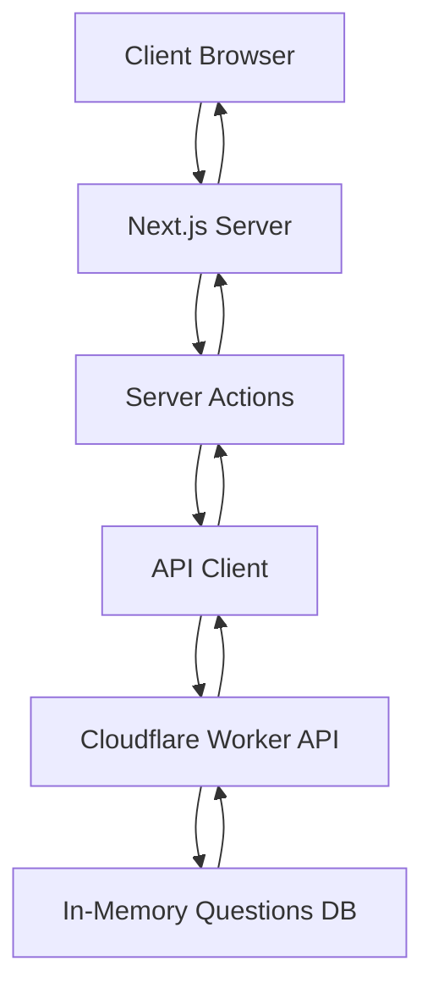

# Interactive Quiz Application

A full-stack quiz application built with Next.js, Cloudflare Workers, and React 19. This monorepo demonstrates modern web development practices with edge computing, server components, and type-safe development.

## 🚀 Quick Start

### Prerequisites

- Node.js >= 18
- pnpm 10.19.0 or higher

### Installation

```bash
# Clone the repository
git clone [repository-url]
cd quiz

# Install dependencies
pnpm install
```

### Development

```bash
# Start all development servers
pnpm dev

# This runs:
# - Web app: http://localhost:3001
# - API: http://localhost:8787
```

### Build

```bash
# Build all packages and applications
pnpm build
```

### Other Commands

```bash
# Run linting
pnpm lint

# Type checking
pnpm check-types

# Format code
pnpm format

# Run tests (API only)
pnpm test
```

## 🏗️ Architecture

### Project Structure

This is a **Turborepo monorepo** using **pnpm workspaces**:

```
quiz/
├── apps/
│   ├── web/              # Next.js frontend (port 3001)
│   └── api/              # Cloudflare Worker API
├── packages/
│   ├── ui/              # Shared React component library
│   ├── eslint-config/   # Shared ESLint configuration
│   ├── tailwind-config/ # Shared Tailwind configuration
│   └── typescript-config/ # Shared TypeScript configurations
```

### Runtime Environments

#### Frontend: Node.js Runtime (Next.js)
- **Framework**: Next.js 16 with React 19
- **Router**: **App Router** (not Pages Router)
- **Rendering**: Server Components with Server Actions
- **State Management**: React hooks (`useActionState`, `useState`)
- **Data Fetching**: Server Actions calling API endpoints

#### Backend: Edge Runtime (Cloudflare Workers)
- **Framework**: Hono 4.10 - lightweight edge framework
- **Runtime**: Cloudflare Workers (V8 isolates)
- **Deployment**: Via Wrangler CLI
- **Benefits**:
  - Global distribution
  - Zero cold starts
  - Automatic scaling
  - No server management

### Data Flow Architecture



## ✅ Validation Approach

### Three-Layer Validation Strategy

1. **Client-Side Validation** (Form level)
   - Immediate feedback before submission
   - Prevents unnecessary API calls
   - Validates required fields and format

2. **Server Action Validation** (Next.js server)
   - **Zod schemas** for runtime type safety
   - Validates data before API calls
   - Type inference from schemas
   ```typescript
   quizStartSchema: {
     questionLimit: z.number().min(8).max(12),
     timeLimit: z.number().min(60).max(600),
     shuffleQuestions: z.boolean()
   }
   ```

3. **API Validation** (Cloudflare Worker)
   - Custom validation functions (not Zod to keep bundle light)
   - Validates request structure and data types
   - Returns detailed error messages

### Validation Flow

```
User Input → Client Validation → Server Action (Zod) → API (Custom) → Response
```

## 📚 Libraries Used

### Frontend (apps/web)

| Library | Version | Purpose | Rationale |
|---------|---------|---------|-----------|
| **next** | 16.0.0 | React framework | Server components, App Router, built-in optimizations |
| **react** | 19.2.0 | UI library | Latest features including Server Actions |
| **zod** | 4.1.12 | Schema validation | Type-safe runtime validation with TypeScript inference |
| **tailwindcss** | 4.1.5 | Styling | Utility-first CSS, v4 for modern features |

### API (apps/api)

| Library | Version | Purpose | Rationale |
|---------|---------|---------|-----------|
| **hono** | 4.10.4 | Web framework | Optimized for edge runtime, lightweight, type-safe |
| **wrangler** | 4.45.3 | CF deployment | Official Cloudflare Workers CLI |
| **vitest** | 2.1.8 | Testing | Fast unit testing with edge environment support |

### UI Package (packages/ui)

| Library | Version | Purpose | Rationale |
|---------|---------|---------|-----------|
| **@radix-ui/*** | Various | Headless UI | Accessible primitives, unstyled for flexibility |
| **class-variance-authority** | 0.7.1 | Component variants | Type-safe variant styling |
| **lucide-react** | 0.548.0 | Icons | Consistent icon set, tree-shakeable |
| **sonner** | 2.0.7 | Toast notifications | Beautiful, accessible notifications |
| **tailwind-merge** | 3.3.1 | Class merging | Resolve Tailwind class conflicts |

## 🎯 Trade-offs and Shortcuts

### Development Speed Optimizations

1. **TypeScript Build Errors Ignored**
   ```typescript
   // next.config.ts
   typescript: { ignoreBuildErrors: true }
   ```
   - ⚡ **Benefit**: Faster iteration during development
   - ⚠️ **Risk**: Potential runtime errors in production
   - 🎯 **Better approach**: Fix type errors properly

2. **No Database Layer**
   - Questions stored in-memory (`src/data/questions.ts`)
   - ⚡ **Benefit**: Zero setup, no DB costs
   - ⚠️ **Limitation**: Can't scale, no persistence
   - 🎯 **Production**: Add PostgreSQL/MongoDB/D1

3. **Open CORS Policy**
   ```typescript
   cors({ origin: '*' })
   ```
   - ⚡ **Benefit**: Works from any domain during dev
   - ⚠️ **Risk**: CSRF vulnerability
   - 🎯 **Production**: Whitelist specific origins

### Architectural Decisions

1. **Server Actions vs Traditional API Calls**
   - ✅ **Chosen**: Server Actions
   - 📝 **Rationale**: Type-safe, automatic serialization, built-in error handling
   - 🔄 **Alternative**: Client-side fetch with tRPC/REST

2. **Edge Runtime vs Node.js for API**
   - ✅ **Chosen**: Edge (Cloudflare Workers)
   - 📝 **Rationale**: Global distribution, zero cold starts, cost-effective
   - 🔄 **Alternative**: Node.js with Express/Fastify

3. **Monorepo vs Separate Repos**
   - ✅ **Chosen**: Monorepo with Turborepo
   - 📝 **Rationale**: Shared code, consistent tooling, atomic commits
   - 🔄 **Alternative**: Separate repos with npm packages

4. **Radix UI + Tailwind vs Component Library**
   - ✅ **Chosen**: Headless UI + utility CSS
   - 📝 **Rationale**: Maximum customization, small bundle, accessibility
   - 🔄 **Alternative**: Material-UI, Ant Design, Chakra UI

### Security Considerations

| Issue | Current State | Production Fix |
|-------|--------------|----------------|
| No Authentication | Anyone can take quiz | Add auth (NextAuth.js/Clerk) |
| No Rate Limiting | Unlimited requests | Add rate limiting middleware |
| No Input Sanitization | Basic validation only | Add DOMPurify for XSS protection |
| Answers in Client Memory | Could be inspected | Move grading to server-only |
| No Session Management | Stateless | Add session tokens |

## 🚦 Features

### Current Implementation

- ✅ Interactive quiz with multiple question types (text, radio, checkbox)
- ✅ Configurable quiz settings (question count, time limit, shuffling)
- ✅ Real-time countdown timer with visual indicators
- ✅ Progress tracking during quiz
- ✅ Instant grading with detailed results
- ✅ Responsive design for mobile/desktop
- ✅ Accessibility features (ARIA labels, keyboard navigation)
- ✅ Toast notifications for user feedback
- ✅ Deterministic shuffling with seeds

### Question Types Supported

1. **Text Questions**: Free-form text input with case-sensitive option
2. **Radio Questions**: Single-choice selection from multiple options
3. **Checkbox Questions**: Multiple-choice selection

## 🔧 Development Workflow

### Working with Specific Packages

```bash
# Run only the web app
pnpm --filter web dev

# Run only the API
pnpm --filter api dev

# Build only the UI package
pnpm --filter @audiph/ui build

# Test only the API
pnpm --filter api test
```

### Deployment

```bash
# Deploy API to Cloudflare Workers
pnpm --filter api deploy

# Build for production
pnpm build

# The Next.js app can be deployed to Vercel/Netlify/etc.
```

## 📊 Performance Characteristics

### Frontend
- **Bundle Size**: Optimized with tree-shaking
- **First Load**: Server components reduce JS payload
- **Caching**: Turborepo caches build outputs
- **State Management**: Minimal, no heavy libraries

### API
- **Cold Start**: ~0ms (Cloudflare Workers always warm)
- **Response Time**: <50ms globally (edge distribution)
- **Memory**: In-memory questions (no DB latency)
- **Scaling**: Automatic, unlimited

## 🔄 Future Improvements

### High Priority
1. Fix TypeScript build errors
2. Add proper authentication
3. Implement rate limiting
4. Add comprehensive test coverage

### Medium Priority
1. Add database for question persistence
2. Implement user profiles and score history
3. Add question management interface
4. Support for images in questions

### Nice to Have
1. Multiplayer quiz mode
2. Question categories/topics
3. Leaderboards
4. Export quiz results

## 📝 Notes

### Why These Technologies?

- **Next.js App Router**: Latest React patterns, server components reduce client JS
- **Cloudflare Workers**: Global edge deployment, cost-effective scaling
- **Turborepo**: Efficient monorepo builds with caching
- **Tailwind CSS v4**: Modern CSS with better performance
- **Zod**: Runtime validation with TypeScript inference
- **Radix UI**: Accessible by default, unstyled for customization

### Known Limitations

1. **No Data Persistence**: Quiz results are not saved
2. **No User Accounts**: Anonymous usage only
3. **Limited Question Bank**: 15 hardcoded questions
4. **No Admin Interface**: Questions must be edited in code
5. **No Analytics**: No tracking of quiz performance

## 🤝 Contributing

This is a demonstration project showcasing modern web development practices. Feel free to fork and extend!

## 📄 License

[Add your license here]

---

Built with modern web technologies to demonstrate full-stack TypeScript development with edge computing.